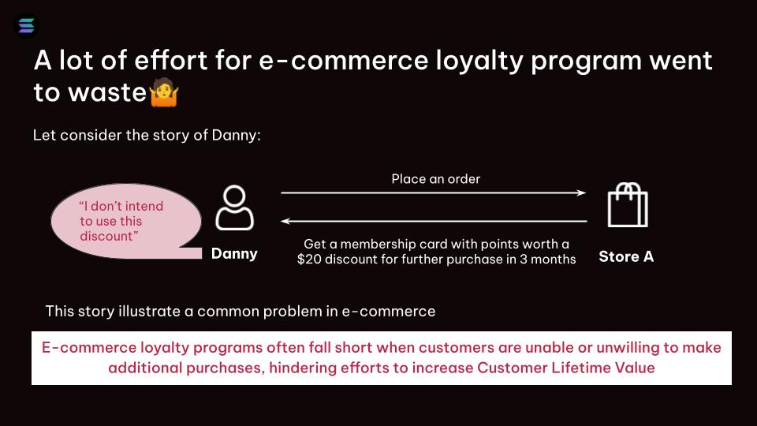

# SoLoyal

## Inspiration

Let's consider the story of Danny, who recently purchased a house from Company A. As part of the purchase agreement, Company A offered Danny a $3000 voucher to be used towards the purchase of a car from their dealership within a year. However, Danny had no intention of buying a car and the voucher would go unused. Faced with this dilemma, Danny decided to sell the voucher to John, who was looking to buy a car from Company A.



With the voucher now in John's possession, he was able to purchase the car he wanted at a $1000 discount, while Danny received $2000 in cash for the voucher he no longer needed. Meanwhile, Company A was able to sell another car and retain a satisfied customer.


This scenario illustrates the challenges that businesses face when it comes to loyalty programs. While they are intended to incentivize customers to make repeat purchases, they often go unused or fail to achieve the desired results. SoLoyal is a loyalty platform that aims to solve this problem by providing a seamless and engaging loyalty experience for customers, while also benefiting businesses and customers alike. By using innovative technology such as NFTs as membership cards, Soloyal offers a unique approach to loyalty programs that can increase customer retention and lifetime value.

## What is SoLoyal?
We are SoLoyal - is a next-generation loyalty platform built on Solana blockchain technology. Our platform uses blockchain technology to create a more transparent, cost-effective, and flexible loyalty program that benefits both businesses and customers. At the core of SoLoyal's platform is our NFT-based membership card system


Our mission at SoLoyal is to revolutionize the loyalty platform industry by creating a platform that is easy to use, accessible to everyone, and capable of delivering real-world benefits to users. We believe that the Solana blockchain is the perfect foundation for this vision. Its high-speed, low-cost transactions enable us to offer a platform that is scalable and affordable, while NFTs provide us with a new way to create value for users.

Unlike traditional loyalty programs, SoLoyal's membership cards are represented as NFTs, or non-fungible tokens, on the Solana blockchain. Each membership card is unique and serves as a digital representation of a customer's loyalty status with a particular business. By using NFTs, SoLoyal is able to offer customers more control and flexibility over their loyalty rewards, while also reducing costs and increasing transparency for businesses.

## How it Works
NFT owner sends NFT to the program, set parameters: number of rental days, rental price,...

Incase the NFTs not yet rented. The system allows NFT owners to update rental information methods
The rental fee will be sent directly to the owner's wallet, minus platform fee. User can see their NFTs by entering their Inventory

## Technical flow
- System overview


- Merchant connect store flow


- Me


- Rent flow


- Cancel listing flow


## Demo product
In this demo version, we build a simple version for integrated with Shopify.

Here is our video

[](https://www.youtube.com/playlist?list=PLJ28CqSGybF5KXpC_74ENRm7Gn-kpJdax)


## What's next for this project
Read more detail at our [WhitePaper](https://soloyal.gitbook.io/whitepaper/4.-roadmap)


## Built with
- NestJs
- NextJs
- PostgreSQL
- Solana web3js, Anchor

## Try it out
// Production link will be here

## How to run project
- Create docker postgreSQL image
- Create backend env file (app/apps/service-graphql-gateway/env/) and replace DB information from step 1
- Run backend
```
cd apps
npx nx serve service-graphql-gateway
```
- Run frontend
```
cd apps
npx nx serve service-www
```