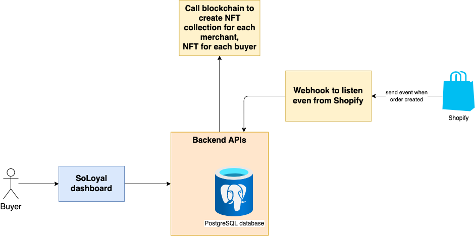

# SoLoyal

## Inspiration
We are SoLoyal - is a next-generation loyalty platform built on Solana blockchain technology. Our platform uses blockchain technology to create a more transparent, cost-effective, and flexible loyalty program that benefits both businesses and customers. At the core of SoLoyal's platform is our NFT-based membership card system

Our mission at SoLoyal is to revolutionize the loyalty platform industry by creating a platform that is easy to use, accessible to everyone, and capable of delivering real-world benefits to users. We believe that the Solana blockchain is the perfect foundation for this vision. Its high-speed, low-cost transactions enable us to offer a platform that is scalable and affordable, while NFTs provide us with a new way to create value for users.

Unlike traditional loyalty programs, SoLoyal's membership cards are represented as NFTs, or non-fungible tokens, on the Solana blockchain. Each membership card is unique and serves as a digital representation of a customer's loyalty status with a particular business. By using NFTs, SoLoyal is able to offer customers more control and flexibility over their loyalty rewards, while also reducing costs and increasing transparency for businesses.
In the following sections of this whitepaper, we will explore SoLoyal's main features, roadmap, and team, and explain how our platform is poised to revolutionize the loyalty program industry.

## What is SolPlay?
SolPlay is an NFT rental platform that connects NFT owners - who can earn from their idle NFT and NFT users who want to experience and access scarce NFTs.

The Program will keep NFT during the rental process, so it ensures that the process is completed according to the agreement and does not lose NFT.

## How it Works
NFT owner sends NFT to the program, set parameters: number of rental days, rental price,...

Incase the NFTs not yet rented. The system allows NFT owners to update rental information methods
The rental fee will be sent directly to the owner's wallet, minus platform fee. User can see their NFTs by entering their Inventory

## Technical flow
- System overview

- Listing flow

- Update item info after listing (đang không có ai thuê)

- Rent flow

- Cancel listing flow

## Demo product
In this demo version, we build a simple version for Starbots - First-ever robot battle game on Solana.

Here is our video

## What's next for this project
- Complete all other parts such as (Market, Register, Inventory, Profile, Profit Management)
- Complete the admin section to manage the collection and operation
- Developing a new form of rental:
  - Profit Share: Owner sets the % share when the user uses NFT to play and earn tokens in GameFi or DApp (and will give a trust rating to Renter from the Owner's side to avoid the case that the Owner does not have any revenue because the Renter does not make any.)
  - Flexible Rent - Fixed price: Owner sets up rent by day or week and maximum and minimum rental period; Renters can choose the rental period that suits their needs
  Diversity of tokens to make transaction payments

## Built with
- NestJs
- NextJs
- PostgreSQL
- Solana web3js, Anchor

## Try it out
// Production link will be here

## How to run project
Because we fork from running project, which use many services of AWS, so it has a little complex. We are cleaning un-use component and update here soon