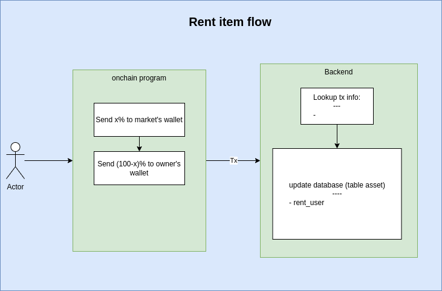

# SolPlay

## Inspiration
We are Solplay - a part of Starbots, a first-ever Robot battles NFT games in Solana.

GameFi is one of the most interesting keywords for investors today. However, because of quick growthing, there are a lot of difficulty for investors NFT owners must make an initial (possibly quite large) account investment to purchase NFT and even can’t purchase it because of its scarcity .

In opposite, there are many investors don’t have time for their NFTs

So a question came to our mind “Is there an easier way for players to access GameFi? How to maximize their investment based on NFTs? ".

So we created an NFT Renting platform - SolPlay.

## What is SolPlay?
SolPlay is an NFT rental platform that connects NFT owners - who can earn from their idle NFT and NFT users who want to experience and access scarce NFTs.

The Program will keep NFT during the rental process, so it ensures that the process is completed according to the agreement and does not lose NFT.

## How it Works
NFT owner sends NFT to the program, set parameters: number of rental days, rental price,...

Incase the NFTs not yet rented. The system allows NFT owners to update rental information methods
The rental fee will be sent directly to the owner's wallet, minus platform fee. User can see their NFTs by entering their Inventory

## Technical flow
- System overview

- Listing flow

- Update item info after listing (đang không có ai thuê)

- Rent flow

- Cancel listing flow

## Demo product
In this demo version, we build a simple version for Starbots - First-ever robot battle game on Solana.

Here is our video

## What's next for this project
- Complete all other parts such as (Market, Register, Inventory, Profile, Profit Management)
- Complete the admin section to manage the collection and operation
- Developing a new form of rental:
  - Profit Share: Owner sets the % share when the user uses NFT to play and earn tokens in GameFi or DApp (and will give a trust rating to Renter from the Owner's side to avoid the case that the Owner does not have any revenue because the Renter does not make any.)
  - Flexible Rent - Fixed price: Owner sets up rent by day or week and maximum and minimum rental period; Renters can choose the rental period that suits their needs
  Diversity of tokens to make transaction payments

## Built with
- NestJs
- NextJs
- PostgreSQL
- Solana web3js, Anchor

## Try it out
// Production link will be here

## How to run project
Because we fork from running project, which use many services of AWS, so it has a little complex. We are cleaning un-use component and update here soon